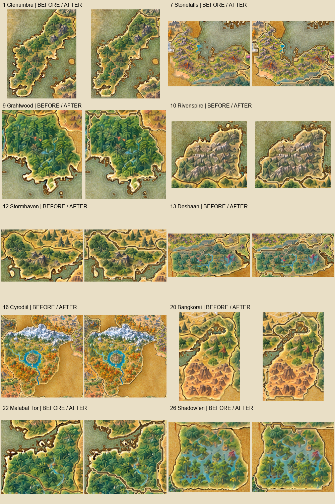
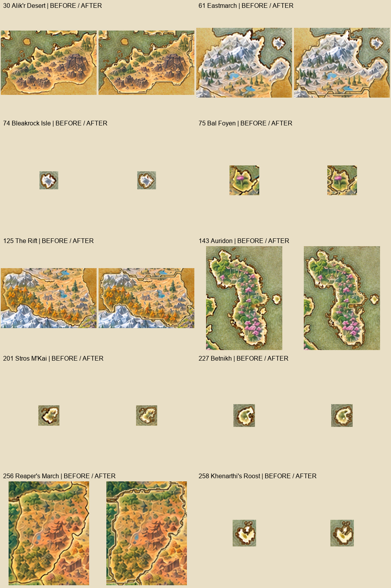
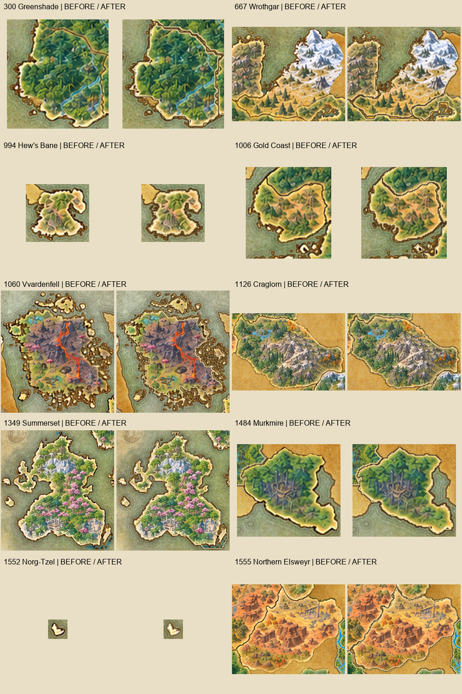
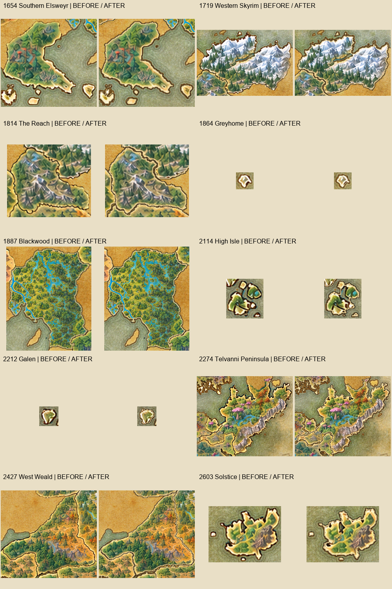

# Проверка границ всех 40 зон

Версия 2.0.2. На каждом листе слева — предыдущая сборка, справа — исправленная; по десять зон на листе. Проверены все четыре листа, включая Ротгар, Стоунфолз и полуостров Телванни. Это сборка файлов аддона, не снимки из игры.

## Лист 1

## Лист 2

## Лист 3

## Лист 4

Автопроверка: [результаты по каждой зоне](border-coverage.json). Она проверяет покрытие внешнего контура с допуском в один пиксель, отсутствие удалённых от контура штрихов и порядок слоёв предпросмотра. Проверка отображения на GPU ESO остаётся отдельным шагом.
