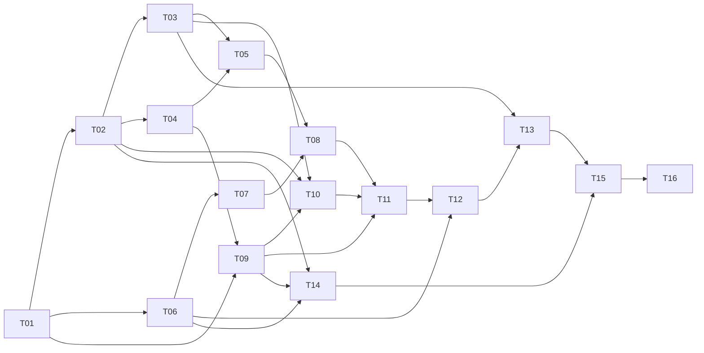

# KanaEffects Implementation Plan

> **For agentic workers:** REQUIRED SUB-SKILL: Use superpowers:subagent-driven-development (recommended) or superpowers:executing-plans to implement this plan task-by-task. Steps use checkbox (`- [ ]`) syntax for tracking.

**Goal:** Создать отдельный ESO-аддон KanaEffects с компактными произвольными виджетами эффектов и удобным редактором, по согласованному макету.

**Architecture:** Один слой наблюдений питает все виджеты. Чистые модули каталога, правил, свёртки и геометрии отделены от ESO API, отрисовки и транзакционного редактора. Явные исключения наборов дают непересекающиеся панели, независимые виджеты допускают дублирование; в редакторе используется та же геометрия, что в бою.

**Tech Stack:** ESO Lua 5.1, нативные controls/scenes/HUD_MANAGER, SavedVariables, встроенный Script Profiler. Офлайн-тесты: Python + `lupa.lua51` (проверена Lupa 2.8). Обязательных сторонних игровых библиотек в первом выпуске нет; HTML остаётся дизайн-артефактом.

**Spec:** [docs/SPEC.md](../../SPEC.md), утверждена пользователем 3 октября 2026 после правок «без I/II» и «Таймер справа». [Контракты v1](2026-10-03-kana-effects-contracts.md) — обязательное приложение к заданиям.

## Global Constraints

- «Очень читаемый, удобный и компактный HUD для PvE»; PvP не занимает центр готовой раскладки.
- «Один эффект показывается во **всех подходящих гридах**»; исключение набора задаётся явно, не приоритетом виджетов.
- «Глобальное скрытие не подавляет явный слот, в том числе пару и категорию “Еда”».
- «Одна функция раскладки используется внутри и вне редактора; вход/выход не сдвигает ни одну ячейку».
- «Букв I/II рядом с таймерами нет: уровень определяется цветом и постоянным порядком»: Minor сверху голубым, Major снизу золотым.
- Четыре режима: `over`, `under`, `right`, `list`; right не резервирует название.
- «Короткие < 60, долгие ≥ 60» по полной длительности; порог настраиваемый. Unknown, permanent и toggle не смешиваются.
- «История — LRU до 1000 уникальных ключей»; «до 10 Гц для десятых»; пустой HUD не сканирует каталог циклически.
- Нагрузка 10 виджетов / 200 видимых представлений / 50 изменений в секунду; «начальная цель p95 ≤ 0.5 мс суммарной работы аддона за кадр» — цель для измерения, не обещанный результат.
- Русский клиент, клавиатура/мышь, 2560×1440. 0.80432397 — значение настройки, не доказанный Retina/UI коэффициент.
- Lua 5.1; системный `/opt/homebrew/bin/lua` сейчас 5.4.9 и не является проверкой совместимости.
- Менять только KanaEffects. Не менять Srendarr, KanaAuras и остальные аддоны. Не переносить синтетические ID/семейства из HTML в production.
- Продуктовый addon manifest создаётся при интеграции T08, не во время составления плана. До этого `.addon.in` не загружает аддон в ESO.
- Модель хранит только сообщённые API факты; после потери цели снимок явно помечен, а не выдан за live данные.

## Review Focus

1. Save/Cancel одновременно с реальными событиями и переключением демо: отменяются настройки, сохраняется свежая live-модель → T09/T11.
2. Переиспользование effectSlot и поздние события старой цели: не исчезает новый баф и не смешиваются существа → T03/T13.
3. Кириллица, неполные API-метаданные и несуществующий уровень семейства: поиск работает, ID и эффекты не выдумываются → T02/T10.
4. Смена масштаба/разрешения, большой грид и уничтоженная опора: якорь предсказуем, offscreen не создаёт бесконечно controls → T06/T07/T13.
5. Ошибка профиля, цикл наборов, повторные имена/ID, изменение размера с занятыми слотами: данные сохраняются, ошибка локализована, остальные виджеты работают → T01/T04/T09/T12.

---

## Статус и способ выполнения

Это **план**, реализация ещё не началась. Способ выбран пользователем: субагенты. Координатор запускает нового исполнителя на задание и отдельного reviewer после его отчёта. Субагенты не создают собственных субагентов. Общие API меняются через координатора с обновлением контрактов и заданий-потребителей.

По умолчанию один пишущий исполнитель за раз в общей рабочей копии; независимые направления отмечены в графе, но одновременная запись/коммиты в общий индекс не нужны для этого плана. При доступных четырёх местах root занимает одно; остальные можно использовать для исполнителя, независимого read-only исследования и ревью уже закрытого диапазона. Исследование не меняет файлы исполнителя. Проверка зависимого задания начинается после принятия его поставщиков.

При старте исполнения сохранить текущие согласованные изменения макета/спеки, затем создать/переиспользовать подходящий изолированный worktree по `using-git-worktrees`; не оставлять дизайн вне базового коммита. В этом плане нет просьбы переписывать историю или публиковать репозиторий. Worktree не находится в сканируемой папке AddOns. Установку готового addon tree в `AddOns/KanaEffects` делает только координатор на этапах live-проверки; чужие файлы не трогать, предыдущую версию сохранить вне AddOns.

Использовать журнал выбранного `subagent-driven-development`: baseline commit, выданные задания, отчёты, диапазоны ревью, решения, актуальные blockers. После уплотнения контекста не перевыдавать завершённые задания. Ссылки на `/tmp` из исследования — кэш; доказательства и команды из отчётов сохранять в репозитории.

## Карта модулей и владельцев

Все пути ниже относительно корня KanaEffects. Перечень — будущая структура, не существующий код.

| Владелец | Файлы | Ответственность |
| --- | --- | --- |
| T01 | `Bootstrap.lua`, `KanaEffects.addon.in`, `model/Schema.lua`, `tests/run.py`, `tests/support/*`, `tests/requirements.txt`, `integration/EsoApi.lua`, `dev/ApiProbe.lua` | Namespace, schema, Lua 5.1 harness и проверка API |
| T02 | `catalog/Catalog.lua`, `catalog/Selectors.lua`, `catalog/data/{Families,Categories}.lua`, `localization/{en,ru}.lua` | Реальная классификация/поиск, локализация |
| T03 | `effects/{Store,Sources,History}.lua` | События, поколения сущностей, ограниченная история |
| T04 | `rules/Rules.lua` | Компиляция наборов, DAG, объяснения |
| T05 | `widgets/Projector.lua` | Отбор/hidden/пары/категории, состояние таблиц |
| T06 → T13 | `widgets/Layout.lua`, `integration/Anchors.lua` | Измерения, позиции, якоря, виртуальные границы |
| T07 | `ui/{Renderer,Controls,Timers,FontMetrics}.lua` | Пулы и четыре стиля, планировщик |
| T08 | `Runtime.lua`, `KanaEffects.addon` | Сборка работающего read-only HUD; порядок загрузки |
| T09 | `editor/{Storage,Session,Demo}.lua` | Настройки, атомарный черновик, отдельный тестовый поток |
| T10 | `editor/{Picker,HiddenList}.lua` | Общая библиотека, активные/недавние/скрытые |
| T11 | `editor/{Editor,Inspector,SetEditor}.lua` | Компактная панель, контекстные настройки, наборы |
| T12 | `editor/Gestures.lua` | Drag/drop/resize/клавиатура |
| T13 | `integration/{NativeHUD,TargetView}.lua` + расширение `Anchors.lua` | Штатные опоры, сцены, курсор/снимок цели |
| T14 | `catalog/data/Presets.lua`, `docs/catalog-audit.md` | Проверенный стартовый PvE-профиль и аудит данных |
| T15 | `dev/{Diagnostics,Replay}.lua`, `tests/bench.lua`, `docs/performance.md` | Измерения и ограничение работы/памяти |
| T16 | `tests/integration.lua`, `docs/acceptance.md`, `README.md`, `CHANGELOG.md` | Приёмка целого аддона и установка |

Только текущий владелец меняет свои файлы. `Bootstrap.lua` и manifest после T01/T08 обновляет очередной интеграционный исполнитель в конце задания: в brief перечислить точные подключения. `tests/support/*`, Schema, EsoApi и контракты меняются последовательными заданиями через координатора. Не расширять stubs, чтобы они молча принимали несуществующие ESO методы.

## Зависимости и контрольные точки

Контрольные точки: после T01 — отчёт API; после T08 — настоящий HUD с фиксированным тестовым профилем; после T12 — законченный собственный редактор; после T13/T14 — привязки, цель и реальные пресеты; после T15/T16 — приёмка и измеренная нагрузка. Пока ждём доступ к ESO для пробы, можно делать чистые T02/T04/T06/T09 с явно записанными ограничениями. Нельзя объявить интеграционные этапы проверенными только по mock-тестам.

## Тестовый протокол для всех заданий

В T01 создать `tests/run.py --suite NAME` и `--all`: каждый suite исполняется в свежем `lupa.lua51.LuaRuntime`, `_VERSION == 'Lua 5.1'` проверяется явно; ошибка → ненулевой exit. Скрипт добавляет `/tmp/kana-effects-test-deps` в sys.path, если обычный import недоступен, и печатает инструкцию установки вместо skip. `tests/requirements.txt` фиксирует `lupa==2.8`; установка при необходимости: `python3 -m pip install --target /tmp/kana-effects-test-deps -r tests/requirements.txt`. Сейчас 2.8/Lua 5.1 проверена через `/tmp/kana-cooldown-test-deps`, но новый проект не должен зависеть от чужого временного каталога.

Каждое задание: написать указанные содержательные тесты → выполнить и увидеть ожидаемый FAIL до реализации → минимальная реализация → тот же suite PASS → `git diff --check` → scoped commit → отдельное ревью. Не писать тесты ради наличия текстовых labels или зеркалящие тело функции; для визуальных размеров нужны инварианты/скриншоты. Полный `--all` запускать на интеграционных точках и когда изменение общего контракта затрагивает соседей.

Коммит содержит только перечисленные файлы задания и необходимые явно согласованные подключения. Reviewer получает диапазон BASE..HEAD задания, brief и отчёт; не `HEAD~1`, если коммитов несколько. Пройденные на неизменном коде тесты без причины повторно не запускать.

## Задания

### Task 1: Основа модели, тестовая среда и API-проба

**Files:** Create `Bootstrap.lua`, `KanaEffects.addon.in`, `model/Schema.lua`, `tests/run.py`, `tests/requirements.txt`, `tests/support/{Assert,FakeClock,FakeApi,Fixtures}.lua`, `tests/schema.lua`, `integration/EsoApi.lua`, `dev/ApiProbe.lua`, `docs/api-probe.md`.

**Interfaces:** Produces `KanaEffects`, `Schema.Validate/CopyProfile`, `EsoApi.Build`, тестовый fixture builder и проверенные adapters/capabilities для остальных заданий. Формат данных — contracts v1.

- [ ] Написать `schema_rejects_duplicate_ids_and_nonfinite_coordinates`, `schema_copy_has_no_shared_slot_tables`, `schema_preserves_hidden_slots_on_resize`: NaN/∞ отклонены; duplicate IDs — diagnostics, duplicate display names допустимы; копия не меняет оригинал; слот [3][6] сохраняется при 2×2.
- [ ] Создать harness/requirements и выполнить `python3 tests/run.py --suite schema`: ожидаемый FAIL на отсутствующей Validate; раннер не подменяет Lua 5.1 системной 5.4.
- [ ] Реализовать Schema: типы/конечные числа/положительные целые размеры, допустимые enum, уникальность стабильных ID, отсутствие runtime-данных в профиле; циклические Lua tables в повреждённом профиле отклоняются, CopyProfile не зацикливается. `Bootstrap.lua` пока только namespace; `.addon.in` — шаблон порядка файлов, не активный manifest.
- [ ] Создать `integration/EsoApi.lua` как единственную таблицу доступных нативных функций/менеджеров для инъекции: события, GetNumBuffs/GetUnitBuffInfo, ability metadata, clock, строковая нормализация, controls и capability checks. Сигнатуры копируются из проверенного текущего API, не из догадок. Сделать opt-in `dev/ApiProbe.lua`, выводящий в **локальный диагностический отчёт**, не сообщения игрокам: GetAPIVersion, масштаб/GuiRoot, единицы buff clocks, порядок GetUnitBuffInfo, доступность boss tags, caster-context для GetAbilityBuffType, native registration/options/callbacks. Проверить loss-of-target при курсоре и динамическую регистрацию/удаление HUD элемента. Записать exact paths/результаты в `docs/api-probe.md`; неизвестное обозначить unverified.
- [ ] `python3 tests/run.py --suite schema`, Lua 5.1 syntax, `git diff --check` → PASS; commit `feat: establish effects schema and Lua 5.1 harness`; review. Для ранней live-пробы координатор может временно развернуть отдельный минимальный manifest из `.addon.in`, который загружает только probe/его зависимости в тестовой установке KanaEffects; после пробы убрать этот manifest. Это не продуктовый manifest T08 и не установка чужого аддона. Live часть не выдумывать при недоступном клиенте.

### Task 2: Реальный каталог и селекторы

**Files:** Create `catalog/Catalog.lua`, `catalog/Selectors.lua`, `catalog/data/Families.lua`, `catalog/data/Categories.lua`, `localization/en.lua`, `localization/ru.lua`, `tests/catalog.lua`.

**Interfaces:** Consumes T01 api/capability report; produces `Catalog.New/Describe/Resolve/Search/ValidateSelector`, `Selectors.Key/Matches` по контрактам.

- [ ] Тесты `selector_family_pair_matches_both_levels`, `unsupported_major_is_not_selectable`, `food_category_matches_two_different_recipes`, `search_russian_case_english_alias_exact_id`, `unknown_id_is_not_fabricated`, `nil_caster_does_not_use_recipient`: пара совпадает с обоими известными уровнями; отсутствующий уровень disabled; два ID пищи совпадают с food; поиск кириллицы и ID сохраняет точную идентичность.
- [ ] `python3 tests/run.py --suite catalog` → FAIL, затем реализовать каталог версионированных данных и адресный запрос по точному ID. Никаких диапазонных переборов ID во время игры. Для регистра кириллицы — инъекция проверенной ESO UTF-8 нормализации; Lua `string.lower` один недостаточен.
- [ ] Заполнить Families/Categories проверенными данными для текущей API-версии; хранить provenance. GetAbilityBuffType + проверенный mapping задаёт семейство/уровень, отдельные IDs задают food/xp/service. Из HTML не переносить 900xxx/910xxx. Неизвестный origin остаётся unknown; русский текст и английские aliases не являются ключами.
- [ ] `python3 tests/run.py --suite catalog` и `git diff --check` → PASS; commit `feat: add versioned effect catalog and selectors`; review. Неполнота каталога перечислена поимённо, не маскируется искусственными парами.

### Task 3: Поток эффектов, источники и история

**Files:** Create `effects/Store.lua`, `effects/Sources.lua`, `effects/History.lua`, `tests/effects.lua`.

**Interfaces:** Consumes Catalog, clock и API adapter; produces Store/Sources/History и Delta. Один Sources на аддон, не на виджет.

- [ ] Тесты `late_target_remove_cannot_remove_new_target_buff`, `reused_slot_wrong_ability_remove_ignored`, `full_update_reconciles_missing_effects`, `same_name_two_units_stay_separate`, `unsubscribed_listener_never_called`, `history_deduplicates_and_caps_1000`, `synthetic_never_enters_history`.
- [ ] `python3 tests/run.py --suite effects` → FAIL; реализовать initial/full scan через GetNumBuffs/GetUnitBuffInfo и фильтрованные EVENT_EFFECT_CHANGED. effectSlot берётся из API, не index перечисления. Подписывать только реально используемые unit tags, корректно перестраивать на изменение профиля/boss existence.
- [ ] Проверять generation/доступный unitId до применения; неоднозначный поздний diff вызывает проверку текущего snapshot. Remove сверяет slot + ability. Recents агрегирует real key abilityId+наблюдаемый source scope и хранит provenance/lastSeen, размер ≤1000.
- [ ] `python3 tests/run.py --suite effects` → PASS: 1100 уникальных реальных записей оставляют 1000, повтор не растит размер, 250 synthetic добавляют 0. Commit `feat: observe effects with unit generations and bounded history`; review.

### Task 4: Наборы, исключения и объяснения

**Files:** Create `rules/Rules.lua`, `tests/rules.lua`.

**Interfaces:** Consumes Observation/Selector; produces `Rules.Compile`, `compiled:Matches/Explain/AffectedSets`. Не зависит от UI или состава других виджетов.

- [ ] Тесты `duration_boundary_59_60_61`, `one_hour_buff_with_10_seconds_left_stays_long`, `unknown_is_not_permanent`, `include_union_exclude_wins`, `support_and_combat_are_disjoint`, `indirect_cycle_and_dangling_ref_diagnosed`, `rule_order_does_not_change_result`.
- [ ] `python3 tests/run.py --suite rules` → FAIL; реализовать AST и компиляцию DAG с обратным индексом зависимостей. Проверить отрицательные зависимости тоже. Диагностика содержит путь и имена циклических наборов; нельзя молча сделать cycle=false.
- [ ] Сделать Explain с конкретной причиной включения/исключения и происхождением предиката; проверять formal disjointness через явное `B exclude A`, статистику наблюдений отдельно. Изменение A инвалидирует зависимый B и его виджеты.
- [ ] `python3 tests/run.py --suite rules` → PASS; commit `feat: compile reusable sets and explicit exclusions`; review.

### Task 5: Проекции таблиц и гридов

**Files:** Create `widgets/Projector.lua`, `tests/projector.lua`.

**Interfaces:** Consumes Store, Catalog, compiled rules; produces `Projector.BuildWidget/AffectedWidgets` и Entry[].

- [ ] Тесты `effect_appears_in_two_matching_grids`, `hidden_pair_stays_in_fixed_table`, `hidden_minor_leaves_major`, `pair_never_spans_units`, `two_casters_keep_last_known_end`, `category_uses_next_expiry_and_count`, `missing_pair_level_keeps_slot`, `timer_tick_does_not_reorder_grid`.
- [ ] `python3 tests/run.py --suite projector` → FAIL; фильтровать отдельные наблюдения до объединения. Таблица проходит по sparse selectors без скрытия из глобального списка; грид использует union включений, exclusions и hidden, после этого группирует пары.
- [ ] Реализовать точную агрегацию contracts §инварианты 2–3, без суммирования времён; count/uncertain/contributors доступны tooltip. Удаление одного источника/ближайшего food-member не удаляет оставшихся. AffectedWidgets не возвращает все при каждом изменении, если dependency index доказывает независимость.
- [ ] `python3 tests/run.py --suite projector` → PASS; commit `feat: project independent widgets and paired effects`; review.

### Task 6: Геометрия, якоря и границы видимости

**Files:** Create `widgets/Layout.lua`, `integration/Anchors.lua` (screen-only adapter), `tests/layout.lua`.

**Interfaces:** Consumes Widget, Entry[], referenceRect, viewportRect и fontMetrics; produces Layout.Measure/Place/Reanchor/Center. Функции не знают, открыт ли редактор. Минимальный Anchors.New/GetReferenceRect/Observe здесь поддерживает screen, GUI scale/resolution callbacks; stock references расширяются в T13.

- [ ] Тесты `nine_anchor_points_hold_during_growth`, `fixed_rows_and_columns_fill_correctly`, `reanchor_preserves_rect`, `center_works_for_offcenter_anchor`, `hidden_table_cells_reserve_positions`, `right_style_has_no_name_column`, `huge_grid_materializes_only_visible_cells`, `empty_grid_retains_anchor`.
- [ ] `python3 tests/run.py --suite layout` → FAIL; реализовать формулы: origin = reference point + offset − pointFraction × widgetSize; center offset по заданной оси = refSize/2 − relativePoint×refSize + (pointFraction−0.5)×widgetSize. Другая ось не меняется.
- [ ] Measure через реальные метрики шрифта: зарезервировать два таймера в паре, widest допустимые строки `∞`, `?`, `9.9`, `59`, минуты/часы. right = icon + gap + timerColumn; list добавляет nameColumn. Ни редакторская рамка, ни заголовок в Measure не входят.
- [ ] Проверить 2560×1440 и 1920×1080, все 9 точек, минимум/крупный шрифт, логические 100000 ячеек без 100000 controls/placements; менять resolution без внезапного разворота роста. `python3 tests/run.py --suite layout` → PASS; commit `feat: unify widget geometry and anchor growth`; review.

### Task 7: Четыре стиля, пулы и время

**Files:** Create `ui/Renderer.lua`, `ui/Controls.lua`, `ui/Timers.lua`, `ui/FontMetrics.lua`, `tests/rendering.lua`.

**Interfaces:** Consumes Entry[], LayoutResult, clock; produces Renderer и Timers; controls adapter пишет в ESO, fake фиксирует значимые вызовы.

- [ ] Тесты `all_four_styles_keep_pair_order_without_roman_labels`, `only_text_changes_do_not_relayout`, `same_formatted_text_does_not_call_SetText`, `permanent_and_offscreen_have_no_timer_jobs`, `released_control_resets_debuff_and_handlers`, `timer_expiry_notifies_once`, `dispose_unsubscribes_everything`.
- [ ] `python3 tests/run.py --suite rendering` → FAIL; реализовать реальные ESO controls с pooling, детерминированным reset, отдельным слоем editor chrome. Источники цвета — стиль уровня, не remaining time. Название в right не создаётся или выключено без места.
- [ ] Timers.Format: missing=`—`, permanent=`∞`, unknown=`?`; ниже 3 сек десятые, до 60 сек целые, дальше минуты/часы; округление не рисует отрицательные числа. nextChangeAt рассчитывается по следующему изменению строки; общий scheduler ≤10Гц, без таймеров в скрытых сценах. По истечению однократный onExpire → Renderer onExpired(widgetId, entryKey) → Runtime dirty соответствующего виджета; Projector игнорирует expired finite даже до remove-события. Не инвалидировать весь экран.
- [ ] `python3 tests/run.py --suite rendering` → PASS; commit `feat: render pooled effect cells with shared timers`; review. Подлинную читаемость ещё не считать проверенной.

### Task 8: Первый работающий HUD и запуск в ESO

**Files:** Create `Runtime.lua`, `KanaEffects.addon`, `tests/runtime.lua`; Modify `Bootstrap.lua`; save `docs/acceptance.md` initial live log.

**Interfaces:** Consumes T02–T07; produces Runtime.Start/ApplyConfig/Preview/EndPreview/SetVisible/Dispose. Подключить классы строгим manifest order; только Bootstrap создаёт зависимости.

- [ ] Тесты `startup_scans_once_per_unit_not_widget`, `burst_events_coalesce_one_flush`, `expiry_cannot_leave_stale_active_icon`, `hidden_scene_does_not_reappear_when_root_shown`, `empty_hud_no_periodic_catalog_scan`.
- [ ] `python3 tests/run.py --suite runtime` → FAIL; реализовать очередь dirty с объединением в один flush, разделить membership/geometry/timer изменения. Scene fragment владеет root, видимость содержимого — на child. Типовая сборка player/target использует проверенные ID T02, не HTML fixtures.
- [ ] Подключить `/ke` как открытие интерфейса (до T11 — локальное диагностическое сообщение о стадии), `/keprobe` для opt-in пробы; не отправлять сообщения каналам. Сформировать `.addon` с APIVersion, подтверждённой T01, и `SavedVariables: KanaEffectsSettings`. Разрешить HTML/docs в репо, но не исполнять их в игре.
- [ ] `python3 tests/run.py --all` и syntax всех manifest paths → PASS. Координатор устанавливает только task-owned Lua/manifest; restart/reloadui и проверка настоящих иконок, пары, выбора/потери цели. Commit `feat: wire event-driven KanaEffects HUD`; review; unverified live шаг остаётся явно открытым.

### Task 9: Атомарные настройки, сохранение и демо

**Files:** Create `editor/Storage.lua`, `editor/Session.lua`, `editor/Demo.lua`, `tests/session.lua`; Modify `Bootstrap.lua`, `KanaEffects.addon` only for registration.

**Interfaces:** Consumes Schema, Rules.Compile, Runtime; produces Storage/Session/Demo по contracts. Profile per character/world через проверенный ZO_SavedVars:NewCharacterIdSettings, schemaVersion отделён от версии аддона; recents сохраняются отдельно. `Storage.New(api, defaultsProvider)` получает defaults из Bootstrap; до T14 это минимальный пустой валидный профиль, в T14 — Presets.Build, без зашитых demo IDs.

- [ ] Тесты `cancel_restores_every_config_field_but_not_live_time`, `save_writes_once_after_full_validation`, `duplicate_has_no_shared_nested_tables`, `layout_switch_retains_slots_and_grid_rules`, `invalid_draft_does_not_replace_committed`, `corrupt_profile_is_preserved_for_recovery`, `demo_does_not_touch_live_store_or_history`.
- [ ] `python3 tests/run.py --suite session` → FAIL; реализовать закрытые команды из contracts, глубокую копию, validation before swap. При ошибке load сохранить исходные данные в recovery-поле и использовать валидную часть/безопасный профиль с локальной диагностикой, не затирать пользовательский профиль пустым.
- [ ] Demo.Build поддерживает ordinary/50/100/250, фиксированный seed, все четыре состояния пары, ∞/unknown/пусто/длинное имя. Переключение provider не прекращает приём живых событий; выход берёт свежий live store. Не сериализовать демо.
- [ ] `python3 tests/run.py --suite session` → PASS; commit `feat: add transactional widget settings and isolated demo`; review.

### Task 10: Общий picker и скрытый список

**Files:** Create `editor/Picker.lua`, `editor/HiddenList.lua`, `tests/picker.lua`; Modify localization files only for owned new keys, manifest/Bootstrap.

**Interfaces:** Consumes Catalog/History/Store/Session; produces Picker.Open/Close и управление скрытием через Session commands. Один picker для всех мест выбора.

- [ ] Тесты `same_selector_returned_for_slot_and_hidden_list`, `pair_minor_major_choices_respect_catalog`, `recent_boss_effect_preserves_provenance`, `search_exact_id_falls_back_to_api_once`, `unknown_results_do_not_change_selection`, `restore_inactive_hidden_effect`, `picker_virtualizes_1000_results`.
- [ ] `python3 tests/run.py --suite picker` → FAIL; сделать окно: именованные семьи, pair/minor/major; частые/категории; активные; недавние. Поиск с debounce 150мс и кэшем, скролл виртуализирован, Enter выбирает, Escape отменяет только окно, focus возвращается инициатору.
- [ ] Для «Любая еда» вернуть category selector, не ID текущего блюда. Показывать ID/источник/lastSeen и unknown metadata; не предлагать только активные эффекты. Hidden list: поиск, восстановить один/все, уведомление об обходе таблицами; никогда не CancelBuff.
- [ ] `python3 tests/run.py --suite picker` → PASS; live клавиатура/русский поиск/длинные имена/край экрана, запись результата в acceptance log; commit `feat: add shared effect picker and reversible hiding`; review.

### Task 11: Собственный редактор и настройки наборов

**Files:** Create `editor/Editor.lua`, `editor/Inspector.lua`, `editor/SetEditor.lua`, `tests/editor.lua`; Modify Runtime wiring, manifest, localization.

**Interfaces:** Consumes Session, Runtime, Picker, Layout; produces Editor.Open/Select/RequestClose/Dispose. Screen reference уже доступен через Anchors из T06; T13 расширяет тот же adapter штатными опорами.

- [ ] Тесты `editor_and_runtime_use_identical_cell_rects`, `selection_changes_inspector_not_canvas`, `cancel_after_add_delete_hidden_rules_restores_profile`, `live_updates_survive_editor_cancel`, `escape_closes_topmost_then_prompts_dirty_session`, `set_rename_does_not_break_id_references`, `set_delete_with_references_is_rejected`.
- [ ] `python3 tests/run.py --suite editor` → FAIL; создать маленькую перемещаемую панель Save/Cancel/Test/+Widget, доступ к наборам/скрытым. Показать все существующие виджеты; декорации editor overlay, без padding в layout. Пустой грид — служебный контур, не fake aura.
- [ ] Инспектор выбранного виджета: источник, table/grid, размеры, absent hidden/ghost и opacity, четыре стиля, три размера шрифта/иконки, gap, rowWidth только list, fixed rows/columns, включения/исключения наборов, named policy/merge. Координаты якоря X/Y, девять точек, две кнопки центрирования. Поля без текущего применения disabled/hidden, не создают пустую колонку.
- [ ] SetEditor: простые facets, preset и расширенные all/any/not, несколько включений/исключений, ручные selectors через Picker, «Разделить с набором…», Explain и статистика наблюдений без ложного доказательства универсальной непересекаемости. Недопустимый цикл не заменяет валидное правило.
- [ ] `python3 tests/run.py --suite editor` → PASS; `/ke` открывает редактор, Save/Cancel доступны без выхода в меню; live screenshot с actual textures. Commit `feat: build contextual widget and set editor`; review.

### Task 12: Drag/drop, расширение и числовое перемещение

**Files:** Create `editor/Gestures.lua`, `tests/gestures.lua`; Modify Editor/Inspector callback wiring.

**Interfaces:** Consumes Layout/Session commands; Gestures controller получает hit-test и coordinate adapter, завершает один атомарный command. Не переносит live controls вместо назначений.

- [ ] Тесты `drag_threshold_does_not_swallow_click`, `swap_move_alt_copy_across_tables`, `shrink_expand_preserves_coordinate_assignments`, `resize_from_nonzero_anchor_keeps_drag_origin`, `escape_and_mouse_capture_loss_cancel_gesture`, `numeric_arrow_and_shift_adjust_1_and_10`, `out_of_bounds_assignment_can_be_recovered`.
- [ ] `python3 tests/run.py --suite gestures` → FAIL; разделить зоны header/frame move, icon transfer, resize corner. Порог drag 4 UI units после преобразования координат; preview/drop target до release, неверная цель ничего не теряет. Alt-copy на занятой ячейке заменяет только destination, source остаётся.
- [ ] Mouse resize снапится к целой ячейке минимум 1×1. Панель «назначения за границей» даёт перенос/очистку через те же commands; скрытые индексы не исчезают при изменении columns. Поддержать очистку/assign через picker и клавиатуру без обязательного drag.
- [ ] `python3 tests/run.py --suite gestures` → PASS; live move/resize при UI scale и на границах; commit `feat: add safe widget and slot gestures`; review.

### Task 13: Штатный HUD, сцены и просмотр цели

**Files:** Create `integration/NativeHUD.lua`, `integration/TargetView.lua`, `tests/integration_hud.lua`; Modify `integration/Anchors.lua` (из T06), Bootstrap/Runtime/Editor wiring.

**Interfaces:** Consumes T01 capability report, Store.Snapshot, Layout.Reanchor/Center, Session; produces Anchors/NativeHUD/TargetView из contracts.

- [ ] Тесты `target_parent_hidden_does_not_hide_our_content`, `missing_reference_preserves_screen_rect`, `native_and_custom_editors_cannot_edit_one_draft`, `screen_resize_recomputes_reference_without_double_scale`, `late_target_event_does_not_change_captured_snapshot`, `snapshot_time_is_marked_and_resume_uses_live_target`.
- [ ] `python3 tests/run.py --suite integration_hud` → FAIL; привязать к публичным stock controls через геометрию, parent=root аддона. Источник позиции один; native drag и собственный редактор записывают ту же Anchor модель. При пропаже опоры сохраняется last valid screen rect с diagnostic, не (0,0).
- [ ] Реализовать native registration по результату T01: stable control name, один primary anchor, callbacks SavedVarsReady/PropagateSettings/RebuildAllElements. Проверить жизненный цикл добавления/удаления виджета. Если текущий API не позволяет безопасную динамическую синхронизацию, не вызывать выдуманный Unregister и не править private arrays: регистрация сохранённых виджетов при загрузке, изменение состава native editor применяется после /reloadui с явным сообщением; собственный редактор работает сразу. Отдельно проверить, что pending-delete элементы до reload не рисуют боевые эффекты.
- [ ] TargetView подписывается на store и сохраняет последний достоверный live snapshot **до** штатного скрытия/очистки; курсорный просмотр использует его, не уже пустой reticleover; snapshot хранит время исходного наблюдения, время открытия просмотра, title и неизменяемые наблюдения; старое наблюдение не объявляется новым. Таймеры snapshot показывают значения на время исходного наблюдения, пометка «Снимок …»; ResumeLive и возврат в бой восстанавливают текущую цель. Не останавливать player timers. Определить проверенный порядок scene/cursor callbacks в api-probe log.
- [ ] `python3 tests/run.py --suite integration_hud` → PASS, затем /reloadui и реальный stock editor/cursor/target смена/закрытие меню. Commit `feat: integrate native anchors and inspectable target snapshots`; review. Невыполненные live проверки не закрывать mock-результатами.

### Task 14: Готовый PvE-профиль и аудит покрытия

**Files:** Create `catalog/data/Presets.lua`, `tests/presets.lua`, `docs/catalog-audit.md`; Modify Bootstrap defaultsProvider wiring, manifest.

**Interfaces:** `Presets.Build(catalog, viewportRect) -> Profile`; consumes T02 verified selectors и T06 measurement. Неполный каталог не создаёт пустые фиктивные семейства.

- [ ] Тесты `support_excludes_named_combat_buffs_by_default`, `long_negative_effect_stays_combat`, `support_and_combat_have_explicit_exclusion`, `pvp_not_in_central_table_slots`, `preset_has_no_synthetic_ids`, `missing_food_assignment_survives_recipe_change`.
- [ ] `python3 tests/run.py --suite presets` → FAIL; создать четыре стартовых виджета (дальше произвольные): небольшая PvE named table, короткие боевые, боковые поддерживающие, цель. Дефолтные размеры из утверждённого макета, но UI coordinates вычислить относительно реальных screen/action-bar references; центр/персонаж свободны. over по умолчанию; right доступен наравне с остальными, выбор пользователя сохраняется.
- [ ] Поддержка = buff AND (food/xp/service OR (not named AND long/permanent/toggle)); combat = (finite OR debuff OR unknown) MINUS support. Грид named policy отдельно. Для unknown нет молчаливой потери. Global hidden из коробки пуст: не скрывать автоматически «неполезные» по своему усмотрению.
- [ ] В audit перечислить API/version/источники таблицы семейств, ID еды/напитков/опыта, происхождение иконок, непроверенные/неподдерживаемые случаи. Верифицировать текущий клиент, не старые HTML названия. `python3 tests/run.py --suite presets` → PASS; commit `feat: provide verified compact PvE presets`; review.

### Task 15: Производительность и длительная устойчивость

**Files:** Create `dev/Diagnostics.lua`, `dev/Replay.lua`, `tests/bench.lua`, `tests/performance.lua`, `docs/performance.md`; Modify only profiling hooks in Runtime/Renderer/Sources.

**Interfaces:** Diagnostics API из contracts; Replay воспроизводит детерминированный event stream через тот же ingestion API. Diagnostics выключен по умолчанию.

- [ ] Тесты `idle_has_zero_catalog_scans_and_zero_timer_text_writes`, `one_effect_change_does_not_rebuild_unrelated_widgets`, `same_label_no_write`, `pool_and_history_plateau_under_100k_events`, `leaving_scene_removes_timer_jobs`, `demo_does_not_persist`.
- [ ] `python3 tests/run.py --suite performance` → FAIL на отсутствующем instrumentation; реализовать counters scans/SetText/layouts/controls/jobs. Не устанавливать time budget по времени Python harness: это только тест bounded work, не ESO FPS.
- [ ] `python3 tests/run.py --all` и `python3 tests/run.py --suite bench` → PASS; затем реальные ESO замеры idle/solo/group + replay 10 widgets/200 visible/50 changes·s⁻¹ и всплеск 250. Измерять builtin Script Profiler nanosecond records; не получать «0 мс» с millisecond clock и выдавать за ≤0.5 мс. Суммировать self time либо непересекающиеся top-level intervals: не двойной учёт parent/child.
- [ ] Записать p50/p95/max, памяти/controls/history до и после 30 минут смены цели/сцен; отделить profiler overhead. Для p95 >0.5 мс показать hotspots и исправить затронутый модуль с покрывающими тестами; не менять визуальные требования ради цифры. Без live профиля статус `not measured`, не PASS.
- [ ] Commit `perf: instrument and validate bounded effects workload`; review измерений и ограничений.

### Task 16: Приёмка, совместимость и передача

**Files:** Create `tests/integration.lua`, `CHANGELOG.md`; Modify `README.md`, `docs/acceptance.md`, manifest version fields; installer script только при реальной необходимости, без внешних изменений.

**Interfaces:** Consumes законченный addon tree, профили и доказательства T01–T15. Produces reproducible release snapshot и честный acceptance report.

- [ ] Написать интеграционные сценарии `full_edit_session_save_reload`, `cancel_with_live_target_switch`, `blacklist_bypass_fixed_table_end_to_end`, `native_edit_then_custom_edit_uses_same_coordinates`: повторная загрузка сохраняет конфигурацию, не кэш эффектов; оба грида получают aura; blacklist уровня не уничтожает пару полностью; table retains slot.
- [ ] `python3 tests/run.py --suite integration` → PASS; если end-to-end обнаруживает пробел, воспроизвести FAIL, исправить именно пробел, повторить покрывающий сценарий. Искусственно ломать уже работающую интеграцию ради красного прогона не нужно. `python3 tests/run.py --all`, syntax manifest files, `git diff --check` → PASS. Проверить, что manifest не содержит tests/dev replay auto-start и не ссылается на отсутствующие/неверно регистрированные пути.
- [ ] В ESO после /reloadui пройти: четыре стиля, Minor/Major/оба/ни одного/∞/?, hidden/ghost, food recipe replacement, два совпавших грида, непересечение, Все действия Save/Cancel, picker RU/ID/recentboss, drag/Alt/resize/recover, девять якорей/центрирование, snapshot при курсоре, native HUD, меню/бой/смерть/смена зоны и resize. Приложить screenshots на 2560×1440 и реальные метрики размеров. Проверить рядом с установленными Srendarr/KanaAuras без их изменения; пользователь сам выбирает отключение дублирующих панелей штатными настройками игры.
- [ ] Один независимый final reviewer проверяет весь implementation range и отложенные замечания; реальная ошибка не помечается закрытой словом «ограничение». Исправления отправлять одним scoped пакетом с покрывающими тестами. Сохранить unresolved live blockers отдельным списком.
- [ ] Обновить README: установка/обновление/удаление, `/ke`, профили/backup, известные ограничения API, native reload fallback если нужен, отчёт производительности. Commit `docs: record KanaEffects release acceptance`; координатор показывает результат и оставшиеся проверки. Не пушить/публиковать/мержить автоматически.

## Brief и отчёт субагента

Координатор выдаёт исполнителю только global constraints, contracts, конкретное Task N, relevant spec sections, его файлы и подтверждённые решения API; не всю историю разговора. В brief перечислить зависимости и baseline commit. Задание — реализовать и проверить этот deliverable, не следующую фазу. Выход за ownership сначала согласовать с координатором.

Отчёт в отдельном файле журнала:

1. Status: done / partial / blocked; commits BASE..HEAD.
2. Какие публичные функции/данные появились; любое отклонение contracts.
3. Точные команды тестов, результат и покрытые граничные случаи.
4. Что проверено в ESO: версия, действие, наблюдение, ссылка на screenshot/log. Mock-only отдельно.
5. Неразрешённые риски и требуемая следующая проверка; не выводить полные SavedVariables/чужие приватные данные.

Reviewer получает этот report и diff package, проверяет spec compliance и качество; UI без live evidence отмечает как unverified. Координатор фиксирует реальные зависимости/изменения плана в журнале и продолжает разрешённую работу без повторных «продолжать?» между заданиями.

## Проверка полноты плана

| Требование | Задания |
| --- | --- |
| Произвольные виджеты, одинаковая геометрия в редакторе | T05–T08, T11 |
| Таблица, ghost/hidden, DnD, увеличение и сохранение скрытых назначений | T05–T07, T09, T12 |
| Грид фиксированных строк/колонок, 9 точек, координаты/центрирование | T06, T11–T13 |
| Четыре стиля, независимые размеры, без I/II | T06–T07, T11, T16 |
| Общие наборы, дублирование, непересечение, объяснения | T04–T05, T11, T14 |
| Глобально скрытые только в гридах | T05, T09–T10, T16 |
| Общий picker: пары/одиночные/категории/ID/поиск/active/recent | T02–T03, T10 |
| Транзакция Save/Cancel, тестовые данные | T09, T11, T16 |
| Эффекты игрока/цели/босса, курсорный просмотр | T03, T13 |
| Штатные якоря/редактор/сцены | T01, T08, T13 |
| Компактный PvE, реальные иконки и текущие семьи | T02, T08, T14, T16 |
| Отсутствие дорогого polling, пулы, ограниченная история | T03–T08, T10, T15 |
| Установка, восстановление профиля, завершённая live-приёмка | T09, T15–T16 |

Самопроверка при составлении: интерфейсы сведены в отдельный contracts-файл; их потребители названы; тесты всех пяти Review Focus назначены владельцам; публичного Unregister HUD не предполагаем; точность таймера профилирования проверена по API source; актуальные правки таймеров включены. Открытые условия внешней среды вынесены в T01/T13/T15/T16, а не спрятаны за обещанием успешных mocks.
